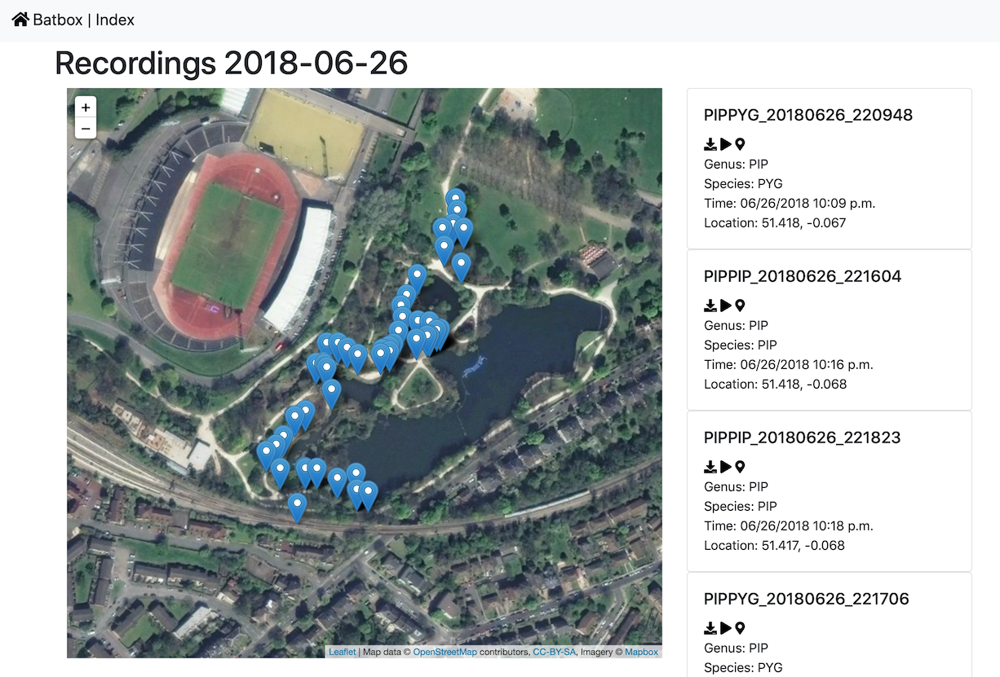

# batbox

### Visualisation utility for Wildlife Acoustics and GUANO-tagged data exports

Demo site: https://batbox.phase.org

         

[Wildlife Acoustics](https://www.wildlifeacoustics.com) are a manufacturer of wildlife audio tracking tools, from hobbyist to professional.
 
[GUANO](https://guano-md.org) is a standardised tag format for recordings of bat echolocation calls.
 
This utility is designed to help sort and visualise data exported from these tools by providing a map and time-based interface to audio recordings. 
It works best with GUANO-tagged files, but can also WAV files from Wildlife Acoustics exports with or without these tags, so long as the related KML files are also present.

So far it's been tested with the output of an 
[Echo Meter Touch 2 Bat Detector](https://www.wildlifeacoustics.com/products/echo-meter-touch-2).

Your recording files should be stored under the `webroot/media/sessions` folder. 
This folder and any subfolders are scanned for new WAV and KML files every time the system is restarted.
                   
### Configuration

The only configuration required is in [`settings.sample.py`](settings.sample.py), which is documented internally.
Copy this to `settings.py` and edit as required.

### Running the code

While this is a web-based application, it's also set up to easily run on your laptop or desktop, if you're familiar with the command line - it should work as-is on MacOS or Linux. 
To run it, you'll need Docker, downloadable at [https://hub.docker.com](https://hub.docker.com) (you'll need to create an account). Once that's installed you can run `./run-docker.sh`
    
This will:

- Build a small web server as a virtual machine on your desktop
- Install the libraries that the project needs, inside the VM
- Configure a database inside the VM
- Set up an `admin` user for the management interface, with a dummy email address
  - The default build process will save the `admin` user's (randomly generated) password to a file in the project directory called `FIRSTPASS.txt`. It's good practice to delete this file once you've read it, and change the password inside the admin interface. 
- Scan the `webroot/media` folder for any relevant WAV or KML files
- and finally start a server which you can reach in your web browser at http://127.0.0.1:8088, where you can use the project

Note that the first build will take a significant time and download a large amount of data. After that, it'll skim through the early steps quite quickly.

It should also be possible to run it on Windows, but you'll need to decipher and replicate `run-docker.sh` to do so.

### What you can do

- Search by time, location and species
- View a calendar of recording sessions
- View sets of recordings (by search, date, species) on a map, and play the audio files in your browser
- View and manage data in an inbuilt admin interface

### Code status

The code is at an alpha state and needs a fair bit of aesthetic cleanup and refactoring, but it's usable.

### Feedback

For questions or bug reports, email [richard@parsingphase.dev](mailto:parsingphase@parsingphase.dev). 

Please note: 

 - This is a hobby project, so time is limited and patience will be appreciated
 - This is one of the first projects of any size that I've built in Python, so the code may not be very neat or idiomatic
 
### Thanks

Particular credit is due to [David Riggs](https://github.com/riggsd) for both building the Guano library used in this project, and being incredibly helpful and responsive in helping to debug an issue with Guano data from the Echo Meter Touch.

Credit is also due to the creators of [Django](https://www.djangoproject.com), particularly the [Django Admin](https://docs.djangoproject.com/en/2.2/ref/contrib/admin/) project which supplies the whole admin interface to the site.

Species full & common names are from the [Mammal Diversity Database](https://www.mammaldiversity.org):
 2019. www.mammaldiversity.org. American Society of Mammalogists. Accessed 2019-06-20 .
 
Please note that mappings from short codes to full species names are heuristic and not entirely foolproof. Any reportings of 
Malaysian Fruit Bats in Kent should be assumed to be a software error.

### Licence

The project is currently licenced under the [MIT](LICENCE.txt) licence, which should allow you to do what you need to with it. I reserve the right to change the licence at a later date, but any such change won't be retroactive - if you receive a MIT version, you can keep using it as such.
           
                   