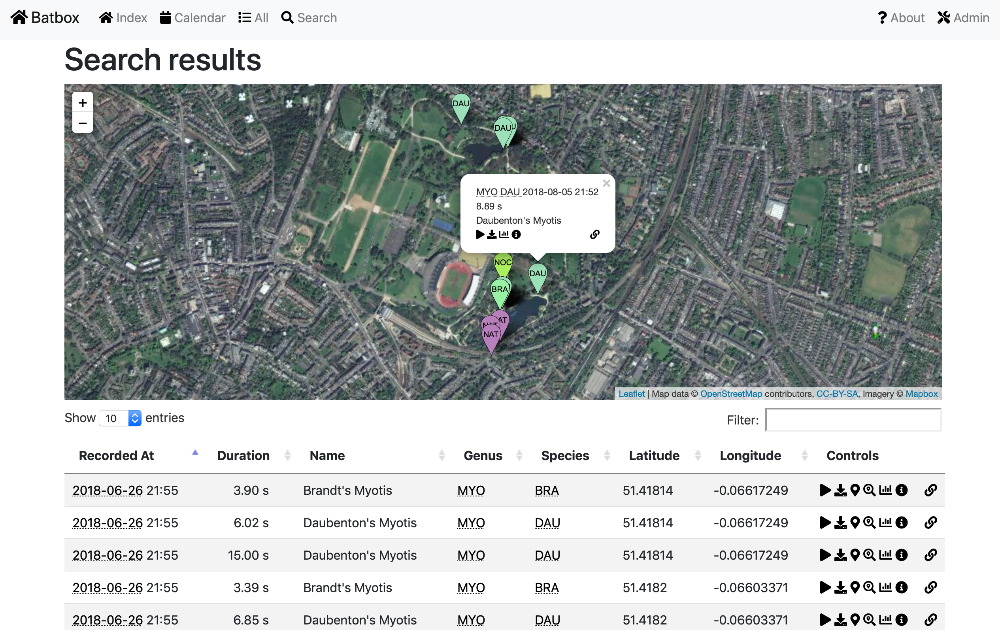

# batbox

### Visualisation utility for Wildlife Acoustics and GUANO-tagged data exports

This documentation can be viewed at [https://parsingphase.dev/batbox/](https://parsingphase.dev/batbox/)

Demo site: [https://batbox.phase.org](https://batbox.phase.org)

         

[Wildlife Acoustics](https://www.wildlifeacoustics.com) are a manufacturer of wildlife audio tracking tools, from hobbyist to professional.
 
[GUANO](https://guano-md.org) is a standardised tag format for recordings of bat echolocation calls.
 
This utility is designed to help sort and visualise data exported from these tools by providing a map and time-based interface to audio recordings. 
It works best with GUANO-tagged files, but can also WAV files from Wildlife Acoustics exports with or without these tags, so long as the related KML files are also present.

So far it's been tested with the output of an 
[Echo Meter Touch 2 Bat Detector](https://www.wildlifeacoustics.com/products/echo-meter-touch-2).

### Running the code

While this is a web-based application, it's also set up to easily run on your laptop or desktop, if you're familiar with the command line - it should work as-is on MacOS or Linux. 

For instructions on how to do so, read [RUNNING-LOCALLY.md](docs/RUNNING-LOCALLY.md).

If you'd like to run the code on your own server, for public view, see [RUNNING-SERVER.md](docs/RUNNING-SERVER.md)

To run a development environment, see [RUNNING-DEVELOPMENT.md](docs/RUNNING-DEVELOPMENT.md)

### What you can do

- Search by time, location and species
- View a calendar of recording sessions
- View sets of recordings (by search, date, species) on a map, and play the audio files in your browser
- View and manage data in an inbuilt admin interface

### Code status

The code is at an alpha state and needs a fair bit of aesthetic cleanup and refactoring, but it's usable.

### Feedback

Please file any issues or bug reports at [https://github.com/parsingphase/batbox/issues](https://github.com/parsingphase/batbox/issues)

If you have any questions about usage, contact [richard@parsingphase.dev](mailto:parsingphase@parsingphase.dev). 

Please note: 

 - This is a hobby project, so time is limited and patience will be appreciated
 - This is one of the first projects of any size that I've built in Python, so the code may not be very neat or idiomatic
 
### Thanks

Particular credit is due to [David Riggs](https://github.com/riggsd) for both building the Guano library used in this project, and being incredibly helpful and responsive in helping to debug an issue with Guano data from the Echo Meter Touch.

Credit is also due to the creators of [Django](https://www.djangoproject.com), particularly the [Django Admin](https://docs.djangoproject.com/en/2.2/ref/contrib/admin/) project which supplies the whole admin interface to the site.

Species full & common names can be loaded from the [Mammal Diversity Database](https://www.mammaldiversity.org) from the 
American Society of Mammalogists.   
 
Please note that mappings from short codes to full species names are heuristic and not entirely foolproof. Any reportings of 
Malaysian Fruit Bats in Kent should be assumed to be a software error.

### Licence

The project is currently licenced under the [MIT](LICENCE.txt) licence, which should allow you to do what you need to with it. I reserve the right to change the licence at a later date, but any such change won't be retroactive - if you receive a MIT version, you can keep using it as such.
           
                   