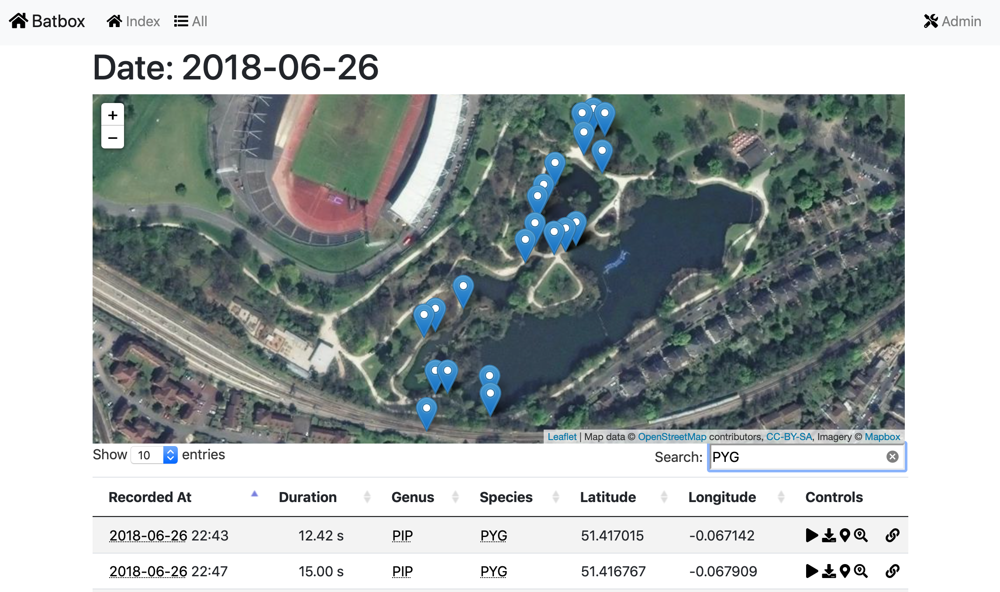

# batbox

### Visualisation utility for Wildlife Acoustics data exports

         

[Wildlife Acoustics](https://www.wildlifeacoustics.com) are a manufacturer of 
wildlife audio tracking tools, from consumer to professional. This utility is 
designed to help sort and visualise data exported from these tools by providing a 
map and time-based interface to audio recordings.

So far it's been tested with the output of an 
[Echo Meter Touch 2 Bat Detector](https://www.wildlifeacoustics.com/products/echo-meter-touch-2).

The export needs to include both the WAV and KML files, which can be achieved with the WiFi export
mechanism.  

Files should be stored under the `webroot/media/sessions` folder, with one folder per session,
each with one KML file, eg:

    webroot/
        media/
            sessions/
                Session 20130401_053030/
                   MYOBRA_20180626_215501.wav
                   ...
                   Session 20180626_214348.kml
                   
### Running the code

The code is not yet configured for production deployment. You can test it on a local computer using
[Docker](https://docker.com). Once that's installed you can run

    ./run-docker.sh
    
then (if all works) view the site in a browser at http://127.0.0.1:8088

Note that the first build will take a significant time and download a large amount of data.

### Code status

The code is in a very early form (3 days old!) and frankly isn't ready for anything.
           
                   